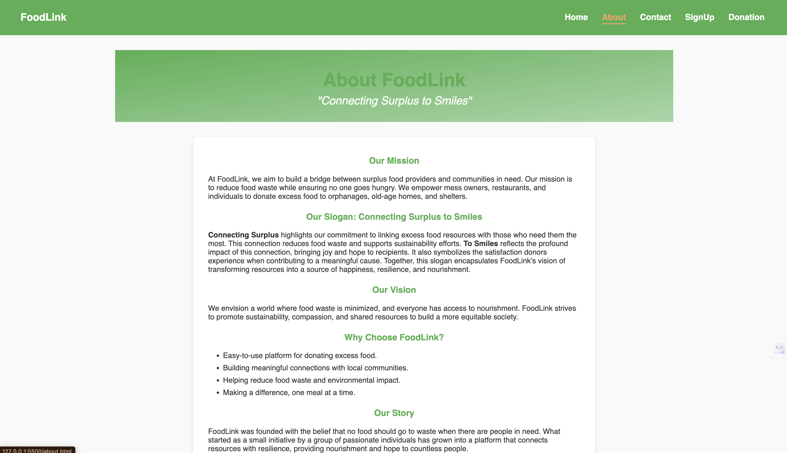

# FoodLink – Connecting Surplus to Smiles

> A web application that reduces food waste by matching surplus donors with organizations in need.

---

## About the Project

FoodLink empowers local messes, restaurants, and households to list excess meals, and enables NGOs or community groups to request and collect them efficiently—fighting hunger and promoting sustainability.

---

## Screenshots

### Home Page

### Login Page

### About Page

---

## Key Features

- Donor and Receiver registration/login
- Create, update, and manage food listings
- Location-based listing and pickup requests
- Admin dashboard for oversight

---

## Tech Stack

| Layer    | Technologies            |
| -------- | ----------------------- |
| Frontend | HTML · CSS · JavaScript |
| Hosting  | GitHub Pages            |

---

## Developer

**Adil**  
[GitHub Profile](https://github.com/Aadiii03)

---

## Contributing

1. Fork the repository
2. Create a feature branch (`git checkout -b feature/name`)
3. Commit your changes (`git commit -m "Add feature"`)
4. Push to your branch (`git push origin feature/name`)
5. Open a Pull Request

Please open an issue first for major changes or new features.

---

## License

This project is licensed under the MIT License.
